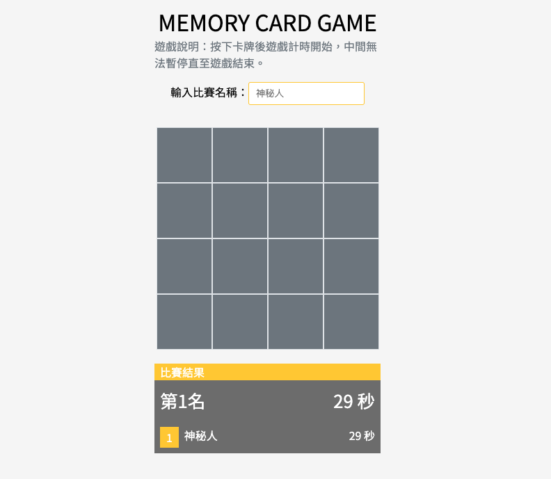

# 記憶卡牌小遊戲

使用 Create React App 製作的記憶卡牌小遊戲。
專案： [DEMO](https://memory-card-game-116e7.web.app)

這是一款名為「記憶卡牌遊戲」的小遊戲。在遊戲中，卡片會被打亂並隨機排列在螢幕上。玩家需要點擊兩張卡片以檢視它們是否相符。如果兩張卡片相符，它們將保持翻開狀態；如果不相符，卡片將會翻回原狀。遊戲的目標是在最短的時間內找出所有匹配的卡片組合。

### 使用者故事

1. 身為一位使用者，我希望可以自動蓋牌。
2. 身為一位使用者，我希望可以點擊兩張卡片來檢視它們是否相符。若相符，卡片便保持翻開；若不符，卡片則會翻回原狀。
3. 身為一位使用者，我希望可以破解遊戲後有一顆再玩一次的按鈕。
4. 身為一位使用者，我希望可以記錄我的分數與排名，並看到其他人的分數。

ᶘ ᵒᴥᵒᶅ

### 部署

clone 專案至本地端

`yarn`
`yarn dev`
